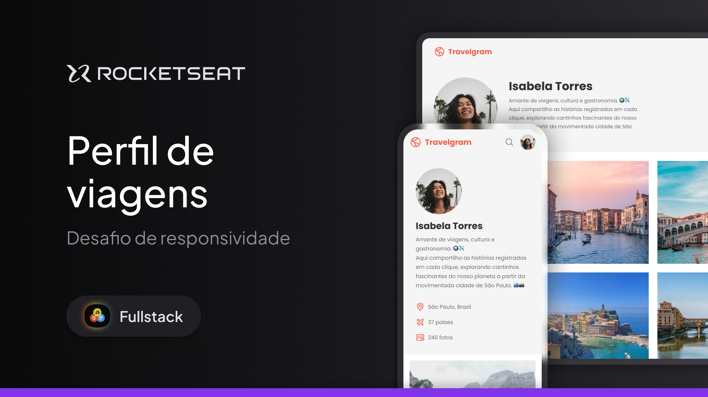

<h1 align="center"> Practical Challenge: Responsiveness - Travel Profile </h1>

In this project, I adapted the layout of a travel photo social network profile to be responsive for mobile and desktop devices. The goal was to ensure a smooth and optimized experience across key screen resolutions.

  <a href="#-tecnologias">Technologies</a>&nbsp;&nbsp;&nbsp;|&nbsp;&nbsp;&nbsp;
  <a href="#-projeto">Project</a>&nbsp;&nbsp;&nbsp;|&nbsp;&nbsp;&nbsp;
  <a href="#-layout">Layout</a>&nbsp;&nbsp;&nbsp;|&nbsp;&nbsp;&nbsp;
  <a href="#memo-licença">License</a>

  

 

  

## 🚀 Technologies
This project was developed with the following technologies:
- HTML and CSS
- Git and Github
- Figma

## 💻 Project
This project involved designing and implementing a responsive layout for a travel photo profile page, ensuring compatibility with mobile and desktop devices. The focus was on maintaining a visually appealing and functional user interface that adapts seamlessly to different screen sizes, prioritizing usability and accessibility.
- [Access the finished project](https://andreskull2.github.io/responsive-travelgram/)
- [Watch the classes](https://www.rocketseat.com.br/formacao/fullstack)

## 🔖 Layout
You can view the project layout through [LINK](https://www.figma.com/community/file/1392188119249243534). You must have an account on [Figma](https://figma.com) to access it.

## :memo: License
This project is under the MIT license.

---
Made with ♥ by Rocketseat :wave: [Join our community!](https://discord.gg/rocketseat)